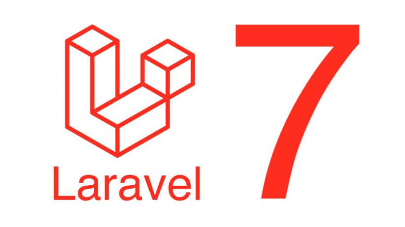

> Template made by fossbarrow IO (https://github.com/fossbarrow)

# Laravel Docker Template
This is a template for Laravel projects thats aimed to run on Docker.

Included in this template, is simplified controllers and a code style checker
for the Laravel code standards.

# Usage
Simply use this template to use it.

See the ([Install & Setup Guide](help/README.md)) to get started.

With this docker template, a dev script is made to ease the development workflow.

```
$ ./dev.sh composer  - For composer commands

$ ./dev.sh artisan   - For artisan commands

$ ./dev.sh npm       - For npm commands

$ ./dev.sh phpcs     - To check if your project follows the Laravel coding standard

$ ./dev.sh phpcbf    - Attempt to fix coding standard failures

```

More commands are listed in the aforementioned setup guide.


## Project
This project running on Laravel 10.x, using docker as the development
environment setup.

> In order to get the very same environment local as production, and amongst the developers, we use docker to emulate the prod server environment!

You can learn more about docker and its possibilities at: [Docker.com](https://store.docker.com/search?type=edition&offering=community)


## Information
Specs:

- php 8.2
- Nginx
- MariaDB 

*Packages included in this template*:

* [PHP CodeSniffer](https://github.com/squizlabs/PHP_CodeSniffer)

**Additional includes**:

* Simplified controllers 
* Better Routes syntax
* Removed empty/unused files that's there after Laravel init

## Requirements

- [Docker](https://store.docker.com/search?type=edition&offering=community)
- [Docker Compose](https://docs.docker.com/compose/install/)
- Any bash terminal
- Windows 10 / Linux / MacOS

## Getting started

Please click here ([Install & Setup Guide](help/README.md)) to get started.


## fossbarrow IO
> https://fossbarrow.io | https://github.com/fossbarrow
